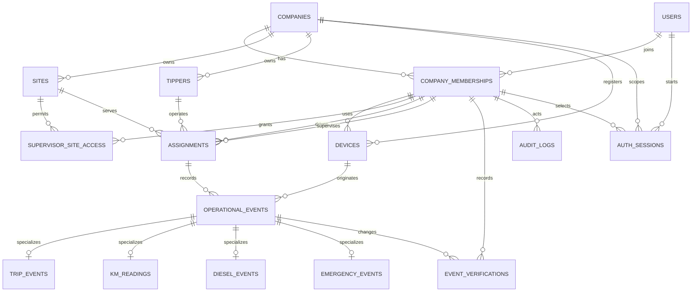

# Phase 2 Domain Model

Phase 1 implements the company-owned tipper core. Phase 2 adds the identity,
session, and authorization persistence needed to protect later business APIs.
HTTP CRUD, mobile synchronization, and business UI remain deferred.

## Implemented entities

| Entity | Purpose |
| --- | --- |
| `Company` | Tenant root and ownership boundary. |
| `User` | Global application identity with normalized phone number and display name. |
| `CompanyMembership` | Company-scoped role (`OWNER_ADMIN`, `SUPERVISOR`, or `DRIVER`) and status. |
| `Site` | Company-scoped work location with company-scoped name/code uniqueness. |
| `Tipper` | Company-owned tipper; registration is stored uppercase without spaces or hyphens. |
| `SupervisorSiteAccess` | Explicit company-consistent supervisor-to-site grant. |
| `Assignment` | Effective-dated driver, supervisor, tipper, and site relationship. |
| `Device` | Minimal installation identifier, platform, membership association, and active/revoked state. |
| `OperationalEvent` | Common server event envelope and company-scoped client UUID idempotency boundary. |
| `TripEvent` | Trip-complete payload attached to an operational event. |
| `KmReading` | Non-negative start/end odometer reading and future object reference. |
| `DieselEvent` | Positive litres issued/recorded and future object reference; not consumption. |
| `EmergencyEvent` | Constrained category, lifecycle status, and optional description. |
| `EventVerification` | Append-only verification history while the envelope stores current status. |
| `AuditLog` | Explicit append-only operational audit record with old/new JSON values and reason. |
| `OtpChallenge` | Short-lived normalized-phone challenge with salted OTP hash, bounded attempts, cooldown, expiry, and delivery metadata hashes. |
| `AuthSession` | Company/membership-scoped server session with hashed refresh token, rotation state, expiry, revocation, and replay family. |

## Actual schema relationships

`company_id` is intentionally carried on every company-owned table and on
composite foreign keys. PostgreSQL therefore rejects a reference to a site,
tipper, membership, assignment, or device belonging to another company.

## Invariants

1. Membership role is the source of assignment eligibility; an owner/admin is
   not silently accepted as a driver and a driver is not accepted as a
   supervisor.
2. Assignment intervals are `[starts_at, ends_at)`. `ends_at` must be after
   `starts_at`, and PostgreSQL exclusion constraints prevent overlaps for the
   same company/driver or company/tipper, including open-ended intervals.
3. Events retain the historical assignment, device-created time, server
   receive time, and independent business verification status.
4. `(company_id, client_event_uuid)` is unique in `operational_events`. A retry
   returns the existing logical event; a different UUID is never deduplicated
   by timestamp similarity.
5. Verification changes append `EventVerification` rows. Current status is
   updated on the event envelope, but the history is not overwritten.
6. Audit entries are explicit and must not contain secrets or unnecessary PII.
7. OTP challenges store no plaintext code, are single-use, expire, and become
   unusable after the bounded failed-attempt count. The phone is normalized
   before lookup or persistence.
8. An authentication session is valid only while its user, membership, and
   company are active and its session is not expired or revoked. Its composite
   company/membership foreign key prevents a cross-tenant session row.
9. Refresh rotation stores only hashes. Reuse of a previous refresh hash
   revokes the complete session family.
