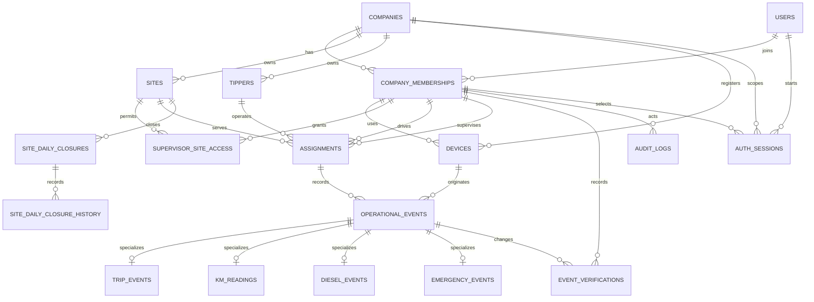

# Domain Model

Phase 1 implements the company-owned tipper core. Phase 2 adds the identity,
session, and authorization persistence needed to protect later business APIs.
Phase 3 adds owner/admin management APIs and an authenticated web shell over
these entities. Phase 4 adds the driver event/evidence boundary and offline
sync queue. Phase 5 adds supervisor verification and site completeness review
without adding a new persistence boundary.

## Implemented entities

| Entity | Purpose |
| --- | --- |
| `Company` | Tenant root and ownership boundary. |
| `User` | Global application identity with normalized phone number and display name. |
| `CompanyMembership` | Company-scoped role (`OWNER_ADMIN`, `SUPERVISOR`, or `DRIVER`) and status. |
| `Site` | Company-scoped work location with company-scoped name/code uniqueness. |
| `Tipper` | Company-owned tipper; registration is stored uppercase without spaces or hyphens. |
| `SupervisorSiteAccess` | Explicit company-consistent supervisor-to-site grant. |
| `Assignment` | Effective-dated driver, supervisor, tipper, and site relationship. |
| `Device` | Minimal installation identifier, platform, membership association, and active/revoked state. |
| `OperationalEvent` | Common server event envelope and company-scoped client UUID idempotency boundary. |
| `TripEvent` | Trip-complete payload attached to an operational event. |
| `KmReading` | Non-negative start/end odometer reading and future object reference. |
| `DieselEvent` | Positive litres issued/recorded and future object reference; not consumption. |
| `EmergencyEvent` | Constrained category, lifecycle status, and optional description. |
| `EventVerification` | Append-only verification history while the envelope stores current status. |
| `AuditLog` | Explicit append-only operational audit record with old/new JSON values and reason. |
| `OtpChallenge` | Short-lived normalized-phone challenge with salted OTP hash, bounded attempts, cooldown, expiry, and delivery metadata hashes. |
| `AuthSession` | Company/membership-scoped server session with hashed refresh token, rotation state, expiry, revocation, and replay family. |
| `EvidenceObject` | Private object-storage metadata scoped to one company, driver membership, and client event UUID. |
| `SiteDailyClosure` | Company/site/operational-date closure snapshot with timezone, state, actor, and timestamps. |
| `SiteDailyClosureHistory` | Append-only close/reopen state transitions with actor, reason, and time. |

## Actual schema relationships

`company_id` is intentionally carried on every company-owned table and on
composite foreign keys. PostgreSQL therefore rejects a reference to a site,
tipper, membership, assignment, or device belonging to another company.

## Invariants

1. Membership role is the source of assignment eligibility; an owner/admin is
   not silently accepted as a driver and a driver is not accepted as a
   supervisor.
2. Assignment intervals are `[starts_at, ends_at)`. `ends_at` must be after
   `starts_at`, and PostgreSQL exclusion constraints prevent overlaps for the
   same company/driver or company/tipper, including open-ended intervals.
3. Events retain the historical assignment, device-created time, server
   receive time, and independent business verification status.
4. `(company_id, client_event_uuid)` is unique in `operational_events`. A retry
   returns the existing logical event; a different UUID is never deduplicated
   by timestamp similarity.
5. Verification changes append `EventVerification` rows. Current status is
   updated on the event envelope, but the history is not overwritten.
6. Audit entries are explicit and must not contain secrets or unnecessary PII.
7. OTP challenges store no plaintext code, are single-use, expire, and become
   unusable after the bounded failed-attempt count. The phone is normalized
   before lookup or persistence.
8. An authentication session is valid only while its user, membership, and
   company are active and its session is not expired or revoked. Its composite
   company/membership foreign key prevents a cross-tenant session row.
9. Refresh rotation stores only hashes. Reuse of a previous refresh hash
   revokes the complete session family.
10. Administrative status changes preserve records for audit/history. New
    assignments may reference only active, same-company driver/supervisor
    memberships, sites, and tippers; their effective-date overlap rules stay
    in the existing domain service and PostgreSQL constraints.
11. Driver events are accepted only for the authenticated driver's effective
    assignment and registered device. KM readings and diesel events require a
    same-driver evidence object; evidence metadata is never a substitute for
    the event envelope or its verification state.
12. Supervisor reads and writes require an active `SUPERVISOR` membership and
    an explicit same-company `SupervisorSiteAccess` row for the event's site.
13. Supervisor verification decisions require the current expected status;
    stale decisions conflict, while each accepted decision appends history with
    actor, timestamp, and optional reason. Emergency acknowledgement is audited
    separately from event verification.
14. Site completeness is derived for each assignment intersecting the UTC review
    day. It does not invent totals or treat diesel litres as consumption.
15. The operational day is a company-configured timezone plus optional local
    start minute; the persisted closure captures the configuration used for
    that day so later setting changes do not rewrite history.
16. Official reports count only approved event envelopes. Distance is available
    only for one unambiguous approved START, one unambiguous approved END, and
    `END >= START`; otherwise the report exposes an exception and `null` KM.
17. Site and tipper reports group by effective-dated Assignment. A transfer
    therefore retains event ownership and prevents double-counting; a reading
    pair split across sites is not silently allocated and produces unavailable
    site KM.
18. A closure cannot bypass missing/conflicting readings, invalid KM, pending
    or disputed trips/diesel, or unresolved emergencies. Reopen history is
    append-only and requires an owner reason.
