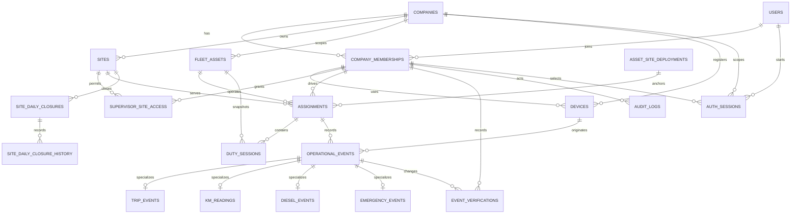

# Domain Model

Phase 1A replaces the tipper-specific persistence core with one canonical
`FleetAsset` model while retaining the physically accepted tipper API contract.
Phase 2 adds the identity,
session, and authorization persistence needed to protect later business APIs.
Phase 3 adds owner/admin management APIs and an authenticated web shell over
these entities. Phase 4 adds the driver event/evidence boundary and offline
sync queue. Phase 5 adds supervisor verification and site completeness review
without adding a new persistence boundary.

## Implemented entities

| Entity | Purpose |
| --- | --- |
| `Company` | Tenant root and ownership boundary. |
| `User` | Global application identity with normalized phone number and display name. |
| `CompanyMembership` | Company-scoped role (`OWNER_ADMIN`, `SUPERVISOR`, or `DRIVER`) and status. |
| `Site` | Company-scoped work location with company-scoped name/code uniqueness. |
| `FleetAsset` | Canonical company fleet record with type, ownership, stable asset code, optional road registration, optional chassis/engine identifiers, status, and rental contact metadata. |
| `SupervisorSiteAccess` | Explicit company-consistent supervisor-to-site grant. |
| `Assignment` | Effective-dated Driver/Operator-to-FleetAsset relationship linked to its deployment; Site is an immutable history snapshot. |
| `Device` | Minimal installation identifier, platform, membership association, and active/revoked state. |
| `OperationalEvent` | Common server event envelope and company-scoped client UUID idempotency boundary. |
| `TripEvent` | Trip-complete payload attached to an operational event. |
| `KmReading` | Non-negative start/end odometer reading and future object reference. |
| `DieselEvent` | Positive litres issued/recorded and future object reference; not consumption. |
| `EmergencyEvent` | Constrained category, lifecycle status, and optional description. |
| `EventVerification` | Append-only verification history while the envelope stores current status. |
| `AuditLog` | Explicit append-only operational audit record with old/new JSON values and reason. |
| `OtpChallenge` | Short-lived normalized-phone challenge with salted OTP hash, bounded attempts, cooldown, expiry, and delivery metadata hashes. |
| `AuthSession` | Company/membership-scoped server session with hashed refresh token, rotation state, expiry, revocation, and replay family. |
| `EvidenceObject` | Private object-storage metadata scoped to one company, driver membership, and client event UUID. |
| `SiteDailyClosure` | Company/site/operational-date closure snapshot with timezone, state, actor, and timestamps. |
| `SiteDailyClosureHistory` | Append-only close/reopen state transitions with actor, reason, and time. |

## Actual schema relationships

```mermaid
erDiagram
    COMPANIES ||--o{ COMPANY_MEMBERSHIPS : has
    USERS ||--o{ COMPANY_MEMBERSHIPS : joins
    COMPANIES ||--o{ SITES : owns
    COMPANIES ||--o{ FLEET_ASSETS : scopes
    COMPANIES ||--o{ DEVICES : registers
    COMPANY_MEMBERSHIPS ||--o{ DEVICES : uses
    COMPANY_MEMBERSHIPS ||--o{ SUPERVISOR_SITE_ACCESS : grants
    SITES ||--o{ SUPERVISOR_SITE_ACCESS : permits
    COMPANY_MEMBERSHIPS ||--o{ ASSIGNMENTS : drives
    SITES ||--o{ ASSIGNMENTS : serves
    FLEET_ASSETS ||--o{ ASSIGNMENTS : operates
    ASSET_SITE_DEPLOYMENTS ||--o{ ASSIGNMENTS : anchors
    FLEET_ASSETS ||--o{ DUTY_SESSIONS : snapshots
    ASSIGNMENTS ||--o{ DUTY_SESSIONS : contains
    ASSIGNMENTS ||--o{ OPERATIONAL_EVENTS : records
    DEVICES ||--o{ OPERATIONAL_EVENTS : originates
    OPERATIONAL_EVENTS ||--o| TRIP_EVENTS : specializes
    OPERATIONAL_EVENTS ||--o| KM_READINGS : specializes
    OPERATIONAL_EVENTS ||--o| DIESEL_EVENTS : specializes
    OPERATIONAL_EVENTS ||--o| EMERGENCY_EVENTS : specializes
    OPERATIONAL_EVENTS ||--o{ EVENT_VERIFICATIONS : changes
    COMPANY_MEMBERSHIPS ||--o{ EVENT_VERIFICATIONS : records
    COMPANY_MEMBERSHIPS ||--o{ AUDIT_LOGS : acts
    SITES ||--o{ SITE_DAILY_CLOSURES : closes
    SITE_DAILY_CLOSURES ||--o{ SITE_DAILY_CLOSURE_HISTORY : records
    USERS ||--o{ AUTH_SESSIONS : starts
    COMPANIES ||--o{ AUTH_SESSIONS : scopes
    COMPANY_MEMBERSHIPS ||--o{ AUTH_SESSIONS : selects
```

`company_id` is intentionally carried on every company-owned table and on
composite foreign keys. PostgreSQL therefore rejects a reference to a site,
fleet asset, membership, assignment, or device belonging to another company.

## Fleet asset model

`FleetAssetType` supports `TIPPER`, `EXCAVATOR`, `BACKHOE_LOADER`, `ROLLER`,
and `GRADER`. `AssetOwnershipType` supports `OWNED` and `RENTED`; ownership is
a management/reporting attribute and does not fork the tipper workflow.
`FleetAssetStatus` uses `ACTIVE` and `INACTIVE`, so historical assets are
deactivated rather than deleted.

Every asset has a non-empty, company-unique `asset_code`. Road registration is
normalized to uppercase without spaces or hyphens when present and is unique
within a company, but remains nullable for construction machinery. Rental end
cannot precede rental start. The centralized `AssetCapabilities` map enables
the current operational workflow only for tippers in Phase 1A; machinery
workflows remain disabled.

Migration `0011_fleet_assets` renames the former table and foreign-key columns
in place. Legacy UUIDs are unchanged. Existing assets become active, owned
tippers, and receive a deterministic code derived from short name when usable
or registration otherwise, with a deterministic UUID suffix only for code
collisions.

## Invariants

1. Membership role is the source of assignment eligibility; an owner/admin is
   not silently accepted as a driver and a driver is not accepted as a
   supervisor.
2. Assignment intervals are `[starts_at, ends_at)`. `ends_at` must be after
   `starts_at`, and PostgreSQL exclusion constraints prevent overlaps for the
   same company/driver or company/asset, including open-ended intervals.
3. Events retain the historical assignment, device-created time, server
   receive time, and independent business verification status.
4. `(company_id, client_event_uuid)` is unique in `operational_events`. A retry
   returns the existing logical event; a different UUID is never deduplicated
   by timestamp similarity.
5. Verification changes append `EventVerification` rows. Current status is
   updated on the event envelope, but the history is not overwritten.
6. Audit entries are explicit and must not contain secrets or unnecessary PII.
7. OTP challenges store no plaintext code, are single-use, expire, and become
   unusable after the bounded failed-attempt count. The phone is normalized
   before lookup or persistence.
8. An authentication session is valid only while its user, membership, and
   company are active and its session is not expired or revoked. Its composite
   company/membership foreign key prevents a cross-tenant session row.
9. Refresh rotation stores only hashes. Reuse of a previous refresh hash
   revokes the complete session family.
10. Administrative status changes preserve records for audit/history. New
    assignments may reference only active, same-company driver/supervisor
    memberships, sites, and compatible active assets; their effective-date overlap rules stay
    in the existing domain service and PostgreSQL constraints.
11. Driver events are accepted only for the authenticated driver's effective
    assignment and registered device. KM readings and diesel events require a
    same-driver evidence object; evidence metadata is never a substitute for
    the event envelope or its verification state.
12. Supervisor reads and writes require an active `SUPERVISOR` membership and
    an explicit same-company `SupervisorSiteAccess` row for the event's site.
13. Supervisor verification decisions require the current expected status;
    stale decisions conflict, while each accepted decision appends history with
    actor, timestamp, and optional reason. Emergency acknowledgement is audited
    separately from event verification.
14. Site completeness is derived for each assignment intersecting the UTC review
    day. It does not invent totals or treat diesel litres as consumption.
15. The operational day is a company-configured timezone plus optional local
    start minute; the persisted closure captures the configuration used for
    that day so later setting changes do not rewrite history.
16. Official reports count only approved event envelopes. Distance is available
    only for one unambiguous approved START, one unambiguous approved END, and
    `END >= START`; otherwise the report exposes an exception and `null` KM.
17. Site and tipper compatibility reports group by effective-dated Assignment. A transfer
    therefore retains event ownership and prevents double-counting; a reading
    pair split across sites is not silently allocated and produces unavailable
    site KM.
18. A closure cannot bypass missing/conflicting readings, invalid KM, pending
or disputed trips/diesel, or unresolved emergencies. Reopen history is
append-only and requires an owner reason.
19. Driver operational duty (`NOT_STARTED`, `ACTIVE`, `ENDED`), device sync,
    and Supervisor verification are independent. Verification never enables or
    disables Driver capture.
20. A locally accepted START permits field capture immediately. Server
    submission remains causal: dependent Trip, Diesel, and END events wait for
    START acceptance without being deleted or hidden from the local queue.
21. A deterministic START rejection keeps the local duty recoverable and marks
    dependent events `blockedPendingStartCorrection`. Correcting the original
    START preserves its client UUID and releases dependents in original order.
22. Emergency is locally durable but has no START/activity sync dependency. UI
    copy distinguishes phone-only persistence from confirmed server receipt.
23. Only an authenticated `OWNER_ADMIN` may create, edit, deactivate, or
    reactivate Fleet Assets. Phase 1B.1 creation accepts only `TIPPER`, and
    company scope always comes from the authenticated membership.
24. A rented Fleet Asset requires `rental_party_name` and a normalized primary
    Owner/Supplier phone; a normalized alternate phone remains optional. An
    owned asset carries no rental-only values. `RENTED -> OWNED` clears the
    party, both phones, and rental dates, while `OWNED -> RENTED` requires an
    explicit party and primary phone. Existing migrated rows remain valid
    because the added contact columns are nullable at the database boundary.
    Optional `chassis_number` and `engine_number` apply to every Asset type.
25. Fleet Asset edits preserve the asset UUID. Direct lifecycle deactivation is
    rejected while an effective assignment or active duty session exists. The
    Owner relationship orchestrator may perform only the documented atomic
    off-duty teardown or the force-close exception in invariant 43. Neither
    path removes assignments, duty sessions, events, verification history,
    evidence, or report history.
26. A People invitation creates or reuses the normalized global `User` and
    creates a tenant-scoped `CompanyMembership` in `INVITED` state. A valid OTP
    session selection activates that same membership UUID. Existing identities
    in another company are not renamed or duplicated.
27. Owner People management is limited to Driver and Supervisor memberships.
    Deactivation is rejected for effective assignments, active Driver duty, or
    remaining Supervisor site access. Records are never hard-deleted.
28. Site name and optional code are case-insensitively unique within a company;
    code is normalized to uppercase. Site deactivation is rejected while an
    effective assignment or active duty exists and preserves the Site UUID and
    historical relationships.
29. Supervisor-to-Site access is tenant-consistent and unique per pair. New
    access requires both an active Site and an active Supervisor membership;
    grant and revoke actions are audited.
30. `AssetSiteDeployment` is the effective-dated source of truth for physical
    Fleet Asset placement. An asset has at most one current deployment and its
    deployment intervals may not overlap; closed rows are retained as history.
31. Deployment and Assignment are independent relationships. An active asset
    may be deployed without a Driver or Supervisor, but any effective Assignment
    must use the same Site as the asset's deployment.
32. Only active assets may be deployed to active Sites. The Owner orchestrator
    moves an off-duty assigned asset by ending the old Deployment and Assignment,
    then optionally creating Site-consistent replacement rows; it never rewrites
    the old Site. Removing a deployment with an off-duty effective Assignment
    atomically ends both relationships at the same timestamp. Active duty blocks
    ordinary move, removal, and lifecycle teardown; only the narrow
    Owner-admin force-close operation in invariant 43 may end it. Assignment and
    deployment rows remain historical records.
33. Supervisor Site asset visibility is derived from current deployment and
    `SupervisorSiteAccess`, not from event existence. Authorized Supervisors see
    active deployed assets with nullable Driver/duty data; unauthorized Sites
    remain inaccessible.
34. Migration from Assignment history copies every historical interval into
    deployment history without rewriting Assignment, duty, event, evidence, or
    reporting ownership. Driver capture and report aggregation remain based on
    their existing Assignment relationships.
35. A current Driver/Operator assignment has `ends_at IS NULL`. Database
    exclusion constraints permit at most one current assignment per Driver and
    per Fleet Asset, including concurrent writes. Every assignment references
    the exact `AssetSiteDeployment` whose company, asset, and Site match.
36. New assignments do not select or own a Supervisor. Supervisor authority is
    derived from current `SupervisorSiteAccess`; the nullable legacy supervisor
    column is retained only to read preserved history.
37. Reassignment closes the prior half-open interval and inserts a new row.
    Active duty blocks ordinary unassign/reassign, while events before the old
    end remain valid and events at or after it cannot attach to that history.
38. Asset reactivation is a lifecycle transition with optional operational
    setup. Reactivate-only leaves the asset undeployed and unassigned;
    reactivation with a Site creates a new deployment interval; adding a Driver
    creates a Site-consistent Assignment in the same transaction. A Driver
    cannot be selected without a Site, an inactive Driver membership requires
    explicit activation, and prior Deployment/Assignment rows remain unchanged
    historical context.
39. A Simple Site Workbook is scoped by one Site and an inclusive range of at
    most 366 company-configured operational days. Any asset whose effective-dated
    Deployment overlaps that range belongs in the workbook, even without an
    Assignment. Daily work and Driver/Operator attribution still come from the
    effective Assignment, duty sessions, and events for that historical day;
    current relationships never backfill older rows.
40. Multiple duty sessions for the same Assignment and operational day use the
    existing authoritative assignment/day first/last meter aggregate. The
    workbook does not recalculate that metric, and retains pending/disputed/
    rejected/amended event status in the daily row. Multiple effective
    Assignments for one asset on the same day remain distinct rows. Days Worked
    counts distinct asset dates with a persisted duty session or non-emergency
    operational event, not mere deployment, assignment overlap, or an
    emergency-only record.
41. Workbook metrics preserve capability state: non-applicable values are
    `N/A`, missing readings remain missing with exceptions, and numeric zero is
    retained only when it is an authoritative applicable value. Recorded-diesel
    ratios are presentation derivatives and exclude pending/unverified diesel.
    Tipper Distance/L is `N/A` for zero/absent recorded diesel and `MISSING` for
    positive diesel with incomplete distance. Machinery L/HMR is `N/A` for a
    missing, incomplete, or zero HMR denominator. Applicable incomplete base
    totals and averages are `MISSING`; valid daily values remain visible where
    safe but are not presented as a complete period total.
42. Simple workbook Pending Items count each non-emergency pending-verification
    event. Exceptions count non-pending structured report exceptions, each
    non-emergency disputed event once. Rejected and amended history remains
    visible in daily status but is not counted as unresolved.
43. `FORCE_CLOSE_DUTY_AND_DEACTIVATE_ASSET` is an exceptional composite
    operation available only to the authenticated `OWNER_ADMIN`. It requires a
    non-empty reason and a current orchestration state token. Execute reloads
    and locks the same-company asset, active Duty Session, Assignment,
    Deployment, Driver, and Site before writing. It closes the duty without
    creating an END KM/HMR event or evidence, ends the Assignment and Deployment
    at the same effective time, deactivates the asset, and appends an audit entry
    with the actor, reason, affected duty/Driver/asset/Site context, and missing
    meter condition. The complete teardown commits or rolls back as one unit;
    stale state conflicts before mutation. Existing reporting emits the
    applicable missing END reading/HMR exception and never derives a false
    distance or machine-hour value. Driver clients treat the server's current
    Assignment and active-duty result as authoritative during reconciliation.

## PC V1 emergency contract

The PC V1 `EMERGENCY` action is a one-tap signal. New events do not require a
category, description, or evidence upload; the backend captures the authenticated
driver, current asset/site/supervisor/company assignment, and timestamp. The
legacy category field remains nullable for historical and compatible clients.
Emergency records use `OPEN -> ACKNOWLEDGED -> RESOLVED` lifecycle actions and
are not normal Trip/KM/Diesel verification items. Rapid repeat open signals in
the short retry window resolve to the existing emergency event while client UUID
idempotency remains the primary retry boundary.

## Device installation and current Driver binding

`Device` is a company-scoped installation identity. `Device.membership_id`
records the current Driver binding and may change through the guarded handover
operation. `OperationalEvent.device_id`, assignment ownership, duty sessions,
and `EvidenceObject.membership_id` remain immutable historical attribution.
Each successful reassignment creates an append-only audit record containing
the device ID and old/new membership IDs.
